# Extend-Attention Design Documentation

## Table of Contents
- [Overview](#overview)
- [KV Cache Architecture](#kv-cache-architecture)
- [Page Management](#page-management)
- [Data Flow: Shortfin to VMFB](#data-flow-shortfin-to-vmfb)
- [Start Positions Explained](#start-positions-explained)
- [Batching Modes Comparison](#batching-modes-comparison)
- [Extend-Attention with Variable Chunking](#extend-attention-with-variable-chunking)
- [Detailed Example Walkthrough](#detailed-example-walkthrough)

---

## Overview

Extend-attention is an optimization for LLM inference that enables efficient batching of prefill requests with varying sequence lengths. Unlike traditional paged attention that requires same-length sequences in a batch, extend-attention tracks history **per-page** rather than per-sequence, allowing variable-length sequences to be processed together.

### Key Benefits

- ✅ **Variable-length batching**: Different sequence lengths in the same batch
- ✅ **Flexible chunking**: Chunks of different sizes can be batched together
- ✅ **Better GPU utilization**: Less padding waste
- ✅ **Higher throughput**: More efficient memory and compute usage

---

## KV Cache Architecture

### Page Pool Structure

The foundation of paged attention is the **Page Pool**, which manages physical GPU memory.

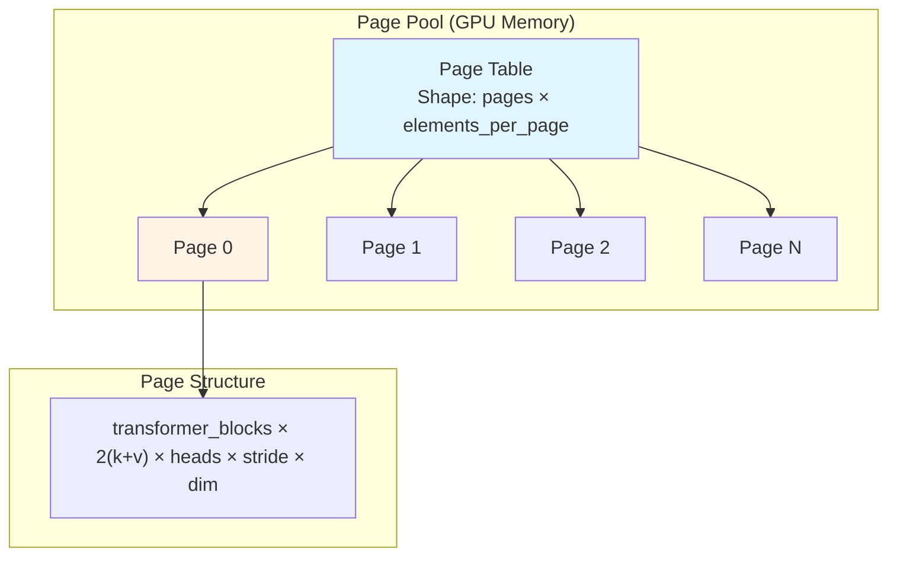
```mermaid
graph TB
    subgraph "Page Pool (GPU Memory)"
        PT[Page Table<br/>Shape: pages × elements_per_page]
        PT --> P0[Page 0]
        PT --> P1[Page 1]
        PT --> P2[Page 2]
        PT --> PN[Page N]
    end

    subgraph "Page Structure"
        P0 --> PE[transformer_blocks × 2#40;k+v#41; × heads × stride × dim]
    end

    style PT fill:#e1f5ff
    style P0 fill:#fff4e6
```

**Example Configuration (Llama 8B)**:
```python
# Page dimensions
transformer_blocks = 32
kv_partitions = 2  # k and v
heads_kv = 8
block_seq_stride = 16  # tokens per page
head_dim = 128

# Total elements per page
elements_per_page = 32 × 2 × 8 × 16 × 128 = 1,048,576
```

### Cache Types

#### 1. Base Cache (No Prefix Sharing)

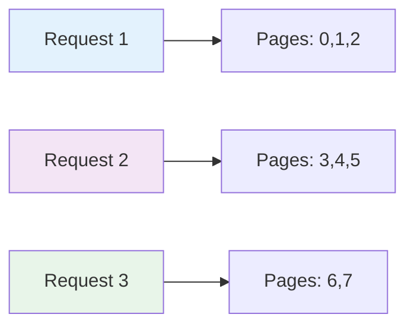
```mermaid
graph LR
    R1[Request 1] --> P1[Pages: 0,1,2]
    R2[Request 2] --> P2[Pages: 3,4,5]
    R3[Request 3] --> P3[Pages: 6,7]

    style R1 fill:#e3f2fd
    style R2 fill:#f3e5f5
    style R3 fill:#e8f5e9
```

Simple allocation: each request gets unique pages.

#### 2. Trie Cache (Prefix Sharing)

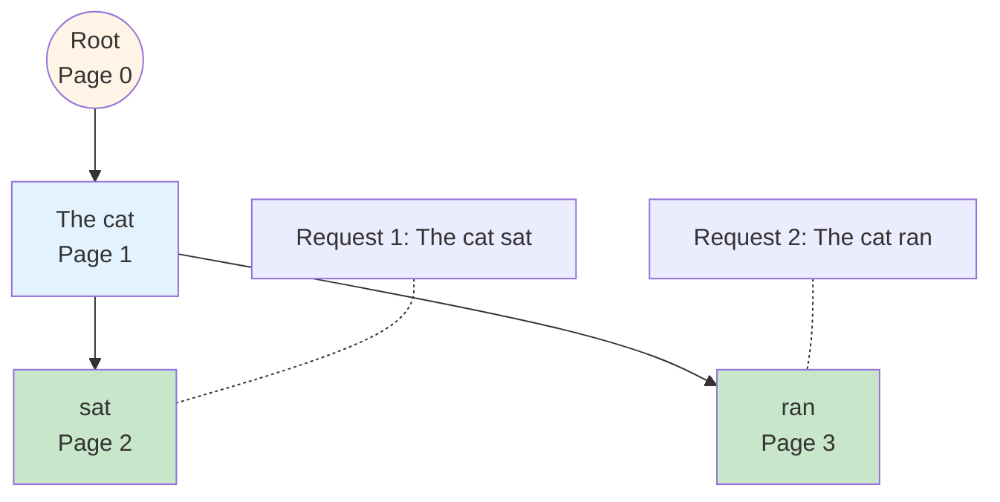
```mermaid
graph TD
    Root((Root<br/>Page 0))
    Root --> N1[The cat<br/>Page 1]
    N1 --> N2[sat<br/>Page 2]
    N1 --> N3[ran<br/>Page 3]

    R1[Request 1: The cat sat] -.- N2
    R2[Request 2: The cat ran] -.- N3

    style Root fill:#fff4e6
    style N1 fill:#e3f2fd
    style N2 fill:#c8e6c9
    style N3 fill:#c8e6c9
```

Common prefixes share the same pages (Page 1 shared by both requests).

---

## Page Management

### Page Allocation Flow

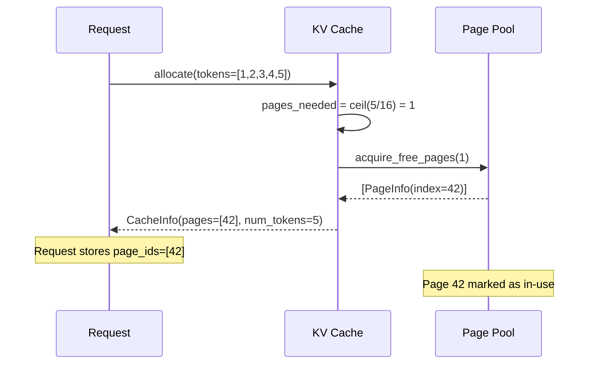
```mermaid
sequenceDiagram
    participant Req as Request
    participant Cache as KV Cache
    participant Pool as Page Pool

    Req->>Cache: allocate(tokens=[1,2,3,4,5])
    Cache->>Cache: pages_needed = ceil(5/16) = 1
    Cache->>Pool: acquire_free_pages(1)
    Pool-->>Cache: [PageInfo(index=42)]
    Cache-->>Req: CacheInfo(pages=[42], num_tokens=5)

    Note over Req: Request stores page_ids=[42]
    Note over Pool: Page 42 marked as in-use
```

### Page Lifecycle Across Invocations

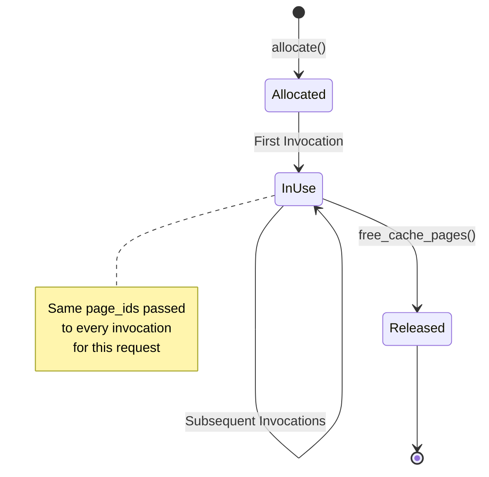
```mermaid
stateDiagram-v2
    [*] --> Allocated: allocate()
    Allocated --> InUse: First Invocation
    InUse --> InUse: Subsequent Invocations
    InUse --> Released: free_cache_pages()
    Released --> [*]

    note right of InUse
        Same page_ids passed
        to every invocation
        for this request
    end note
```

---

## Data Flow: Shortfin to VMFB

### Complete Pipeline

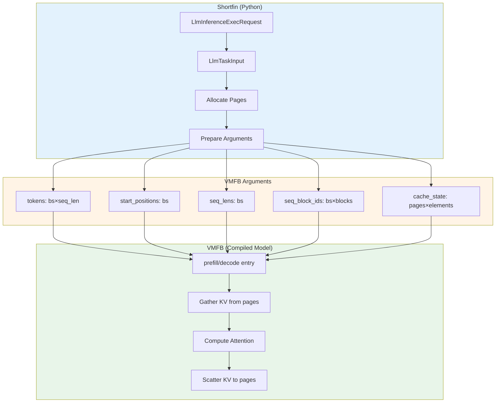
```mermaid
flowchart TB
    subgraph Shortfin["Shortfin (Python)"]
        Req[LlmInferenceExecRequest]
        Task[LlmTaskInput]
        Alloc[Allocate Pages]
        PrepArgs[Prepare Arguments]
    end

    subgraph Args["VMFB Arguments"]
        Tokens[tokens: bs×seq_len]
        StartPos[start_positions: bs]
        SeqLens[seq_lens: bs]
        PageIDs[seq_block_ids: bs×blocks]
        PageTable[cache_state: pages×elements]
    end

    subgraph VMFB["VMFB (Compiled Model)"]
        Entry[prefill/decode entry]
        Gather[Gather KV from pages]
        Attn[Compute Attention]
        Scatter[Scatter KV to pages]
    end

    Req --> Task
    Task --> Alloc
    Alloc --> PrepArgs
    PrepArgs --> Tokens
    PrepArgs --> StartPos
    PrepArgs --> SeqLens
    PrepArgs --> PageIDs
    PrepArgs --> PageTable

    Tokens --> Entry
    StartPos --> Entry
    SeqLens --> Entry
    PageIDs --> Entry
    PageTable --> Entry

    Entry --> Gather
    Gather --> Attn
    Attn --> Scatter

    style Shortfin fill:#e3f2fd
    style Args fill:#fff4e6
    style VMFB fill:#e8f5e9
```

### Argument Preparation Details

**Shortfin Side** (`invocation.py`):

```python
# Example: Batch of 2 requests
task_inputs = [
    LlmTaskInput(
        input_tokens=(1,2,3,4,5),
        seq_len=5,
        page_ids=(42, 43),
        start_position=0
    ),
    LlmTaskInput(
        input_tokens=(10,11,12),
        seq_len=3,
        page_ids=(44,45),
        start_position=0
    )
]

# Prepare buffers
max_seq_len = 16  # page-aligned
max_blocks = 2

# Arguments created:
tokens = [
    [1,2,3,4,5,0,0,0,0,0,0,0,0,0,0,0],      # padded to 16
    [10,11,12,0,0,0,0,0,0,0,0,0,0,0,0,0]    # padded to 16
]  # Shape: [2, 16]

seq_lens = [5, 3]                           # Shape: [2]
start_positions = [0, 0]                    # Shape: [2]
seq_block_ids = [[42, 43], [44, 45]]        # Shape: [2, 2]
cache_state = page_pool.page_tables[0]      # Full page table
```

### Model Side (Gather/Scatter)

**Reading from Cache** (`paged_attention.py`):

```python
def read(page_table, page_ids, transformer_block_index):
    # page_table: [page_count, transformer_blocks, 2, heads, stride, dim]
    # page_ids: [bs, blocks] - e.g., [[42,43], [44,45]]

    # Extract slice for current transformer block
    cache_slice = page_table[:, transformer_block_index, :, :, :, :]

    # Gather pages using page_ids as indices
    kv_data = gather(cache_slice, page_ids)
    # Returns: [bs, blocks, heads, stride, dim]
```

**Writing to Cache** (`paged_attention.py`):

```python
def write(page_table, cache_partitions, page_ids, start_positions):
    # start_positions: [bs] - e.g., [0, 128]
    # Determines which page and offset to write

    # Calculate page indices
    page_index = start_positions // block_seq_stride
    offset = start_positions % block_seq_stride

    # Scatter new KV into page table
    for cache_partition in [k, v]:
        index = page_ids * transformer_count + block_idx
        index_copy_(page_table, index, new_kv_data)
```

---

## Start Positions Explained

### Conceptual Model

`start_positions` is a `[batch_size]` tensor that indicates **where in the sequence** each request should start writing new KV values.

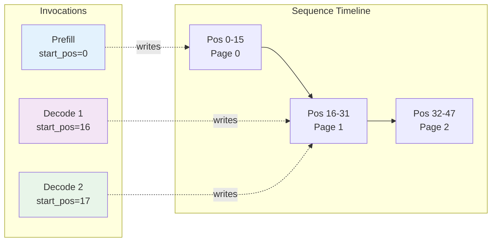
```mermaid
graph LR
    subgraph "Sequence Timeline"
        P0[Pos 0-15<br/>Page 0] --> P1[Pos 16-31<br/>Page 1] --> P2[Pos 32-47<br/>Page 2]
    end

    subgraph "Invocations"
        I1[Prefill<br/>start_pos=0] -.writes.-> P0
        I2[Decode 1<br/>start_pos=16] -.writes.-> P1
        I3[Decode 2<br/>start_pos=17] -.writes.-> P1
    end

    style I1 fill:#e3f2fd
    style I2 fill:#f3e5f5
    style I3 fill:#e8f5e9
```

### Single Request Across Multiple Invocations

**Example: Request with 50 tokens, chunked by 16**

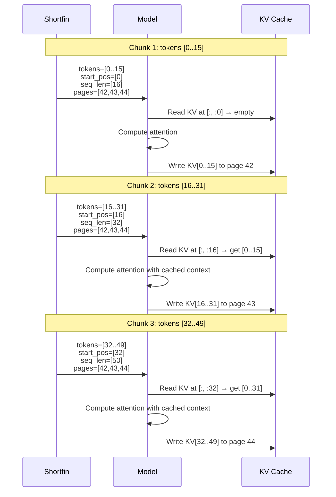
```mermaid
sequenceDiagram
    participant S as Shortfin
    participant M as Model
    participant C as KV Cache

    Note over S,C: Chunk 1: tokens [0..15]
    S->>M: tokens=[0..15]<br/>start_pos=[0]<br/>seq_len=[16]<br/>pages=[42,43,44]
    M->>C: Read KV at [:, :0] → empty
    M->>M: Compute attention
    M->>C: Write KV[0..15] to page 42

    Note over S,C: Chunk 2: tokens [16..31]
    S->>M: tokens=[16..31]<br/>start_pos=[16]<br/>seq_len=[32]<br/>pages=[42,43,44]
    M->>C: Read KV at [:, :16] → get [0..15]
    M->>M: Compute attention with cached context
    M->>C: Write KV[16..31] to page 43

    Note over S,C: Chunk 3: tokens [32..49]
    S->>M: tokens=[32..49]<br/>start_pos=[32]<br/>seq_len=[50]<br/>pages=[42,43,44]
    M->>C: Read KV at [:, :32] → get [0..31]
    M->>M: Compute attention with cached context
    M->>C: Write KV[32..49] to page 44
```

### Key Properties

| Property | Description | Example |
|----------|-------------|---------|
| **Shape** | `[batch_size]` | `[0]` or `[16, 32]` |
| **Semantics** | Absolute position in sequence | `start_pos=16` means "position 16" |
| **Cumulative** | Increases with each chunk | `0 → 16 → 32 → ...` |
| **Per-request** | Each request has its own | Batch can have `[0, 16, 0]` |
| **Usage** | Determines cache read/write offset | Read `[:, :start_pos]`, write at `start_pos` |

---

## Batching Modes Comparison

### Chunked Prefill Mode

**Characteristics**:
- Fixed chunk size (e.g., 128 tokens)
- Batches chunks of same size together
- Simple but less flexible

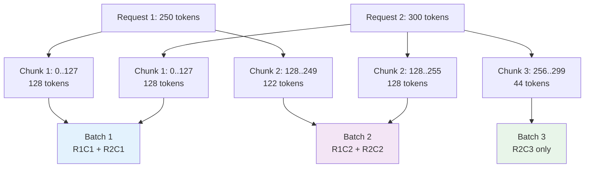
```mermaid
graph TD
    R1[Request 1: 250 tokens] --> R1C1[Chunk 1: 0..127<br/>128 tokens]
    R1 --> R1C2[Chunk 2: 128..249<br/>122 tokens]

    R2[Request 2: 300 tokens] --> R2C1[Chunk 1: 0..127<br/>128 tokens]
    R2 --> R2C2[Chunk 2: 128..255<br/>128 tokens]
    R2 --> R2C3[Chunk 3: 256..299<br/>44 tokens]

    R1C1 --> B1[Batch 1<br/>R1C1 + R2C1]
    R2C1 --> B1

    R1C2 --> B2[Batch 2<br/>R1C2 + R2C2]
    R2C2 --> B2

    R2C3 --> B3[Batch 3<br/>R2C3 only]

    style B1 fill:#e3f2fd
    style B2 fill:#f3e5f5
    style B3 fill:#e8f5e9
```

**Batching Logic** (`default.py`):
```python
# Fixed chunk size
chunk_block_size = 2  # 2 blocks × 16 tokens = 32 tokens
chunk_token_size = chunk_block_size * seq_stride

for i in range(0, exec_request.block_count, chunk_block_size):
    start_position = i * seq_stride  # 0, 32, 64, ...

    input_tokens = exec_request.input_token_ids[
        start_position : start_position + chunk_token_size
    ]
    seq_len = start_position + len(input_tokens)  # Cumulative

    task_input = LlmTaskInput(
        input_tokens=tuple(input_tokens),
        start_position=start_position,  # Absolute
        seq_len=seq_len,                # Cumulative
        page_ids=tuple(exec_request.page_ids),
    )
```

### Extend-Attention Mode (Variable-Size Chunking)

**Characteristics**:
- Variable chunk sizes (e.g., 122, 128, 44 tokens)
- Batches by **token budget only** - no limit on number of requests
- Page-aligned chunks for prefill (must align to `block_seq_stride`)
- Can batch multiple decode requests (1 token each) together
- **Can mix prefill and decode in the same invocation**
- Efficient handling of variable lengths

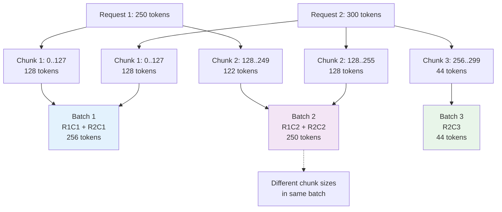
```mermaid
graph TD
    R1[Request 1: 250 tokens] --> R1C1[Chunk 1: 0..127<br/>128 tokens]
    R1 --> R1C2[Chunk 2: 128..249<br/>122 tokens]

    R2[Request 2: 300 tokens] --> R2C1[Chunk 1: 0..127<br/>128 tokens]
    R2 --> R2C2[Chunk 2: 128..255<br/>128 tokens]
    R2 --> R2C3[Chunk 3: 256..299<br/>44 tokens]

    R1C1 --> B1[Batch 1<br/>R1C1 + R2C1<br/>256 tokens]
    R2C1 --> B1

    R1C2 --> B2[Batch 2<br/>R1C2 + R2C2<br/>250 tokens]
    R2C2 --> B2

    R2C3 --> B3[Batch 3<br/>R2C3<br/>44 tokens]

    style B1 fill:#e3f2fd
    style B2 fill:#f3e5f5
    style B3 fill:#e8f5e9

    Note1[Different chunk sizes<br/>in same batch]
    B2 -.-> Note1
```

**Batching Logic** (`extend_attention.py`):
```python
def _create_extend_attention_batches(self, tasks):
    """
    Batch tasks based on token budget only.
    No limit on number of requests per batch.
    """
    batches = []
    remaining = tasks.copy()

    while remaining:
        batch = []
        # Token budget is the only constraint
        batch_token_budget = self.block_seq_stride * self._max_pages_per_batch
        current_token_count = 0

        for task in remaining[:]:
            task_tokens = len(task.input_tokens)
            # For prefill: round up to page boundary
            # For decode: always 1 token
            task_pages = math.ceil(task_tokens / self.block_seq_stride)
            task_padded_tokens = task_pages * self.block_seq_stride

            # Only constraint: total tokens must fit in budget
            if current_token_count + task_padded_tokens <= batch_token_budget:
                batch.append(task)
                remaining.remove(task)
                current_token_count += task_padded_tokens


        if batch:
            batches.append(batch)

    return batches

# Can batch many requests together:
# Example: 10 decode requests (10 tokens) + 2 prefill chunks (240 tokens)
#          = 250 tokens total, fits in 256-token budget
```

### Comparison Table

| Aspect | Chunked Prefill | Extend-Attention |
|--------|----------------|------------------|
| **Chunk Size** | Fixed (e.g., 128) | Variable |
| **Same Batch** | All chunks same size | Chunks can differ |
| **Padding** | To chunk size | To page boundary |
| **Batching Strategy** | By chunk size | By token budget only |
| **Request Limit** | Limited by batch size | Unlimited (token budget only) |
| **Kernel** | Standard attention | `wave_extend_attention` |
| **seq_lens usage** | Same within batch | Different per request |
| **Mix Prefill+Decode** | No | Yes ✓ |
| **Decode Batching** | Limited | Many decodes together |
| **Efficiency** | Lower (padding waste) | Higher (adaptive) |
| **Invocations** | More (smaller batches) | Fewer (larger batches) |

### Mixed Prefill and Decode Batching

A key advantage of extend-attention is the ability to **batch prefill and decode requests together** in the same invocation.

**Example Mixed Batch**:
```python
# Batch with token budget = 256
tasks = [
    # Prefill chunks (page-aligned)
    LlmTaskInput(tokens=128, start_pos=0,   phase=PREFILL),    # 128 tokens
    LlmTaskInput(tokens=64,  start_pos=0,   phase=PREFILL),    # 64 tokens (padded to 64)

    # Decode requests (1 token each)
    LlmTaskInput(tokens=1,   start_pos=50,  phase=DECODE),     # 1 token
    LlmTaskInput(tokens=1,   start_pos=120, phase=DECODE),     # 1 token
    LlmTaskInput(tokens=1,   start_pos=80,  phase=DECODE),     # 1 token
    # ... up to 64 more decode requests
]

# Total: 128 + 64 + 64 = 256 tokens (fits in budget!)
# Processes 2 prefill chunks + 64 decode requests in ONE invocation
```

**Benefits**:
- Maximize GPU utilization by filling token budget
- Reduce latency for decode requests (don't wait for separate batch)
- Better throughput than separating prefill and decode phases

**How it works**:
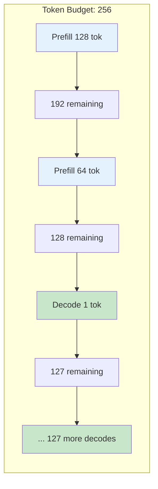
```mermaid
graph LR
    subgraph "Token Budget: 256"
        Prefill1[Prefill 128 tok] --> Budget[192 remaining]
        Budget --> Prefill2[Prefill 64 tok]
        Prefill2 --> Budget2[128 remaining]
        Budget2 --> Decode1[Decode 1 tok]
        Decode1 --> Budget3[127 remaining]
        Budget3 --> Dots[... 127 more decodes]
    end

    style Prefill1 fill:#e3f2fd
    style Prefill2 fill:#e3f2fd
    style Decode1 fill:#c8e6c9
    style Dots fill:#c8e6c9
```

---

## Extend-Attention with Variable Chunking

### Architecture Overview

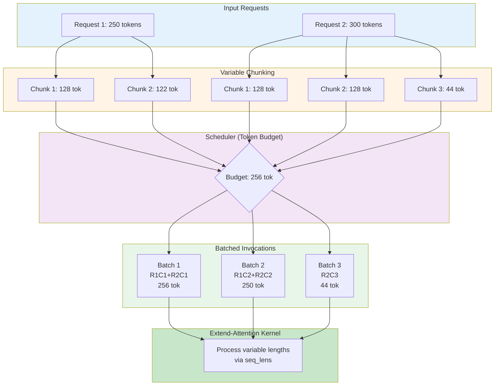
```mermaid
flowchart TB
    subgraph Input["Input Requests"]
        R1[Request 1: 250 tokens]
        R2[Request 2: 300 tokens]
    end

    subgraph Chunking["Variable Chunking"]
        R1 --> R1C1[Chunk 1: 128 tok]
        R1 --> R1C2[Chunk 2: 122 tok]

        R2 --> R2C1[Chunk 1: 128 tok]
        R2 --> R2C2[Chunk 2: 128 tok]
        R2 --> R2C3[Chunk 3: 44 tok]
    end

    subgraph Scheduling["Scheduler (Token Budget)"]
        R1C1 --> Sched{Budget: 256 tok}
        R2C1 --> Sched
        R1C2 --> Sched
        R2C2 --> Sched
        R2C3 --> Sched
    end

    subgraph Batches["Batched Invocations"]
        Sched --> Batch1[Batch 1<br/>R1C1+R2C1<br/>256 tok]
        Sched --> Batch2[Batch 2<br/>R1C2+R2C2<br/>250 tok]
        Sched --> Batch3[Batch 3<br/>R2C3<br/>44 tok]
    end

    subgraph Kernel["Extend-Attention Kernel"]
        Batch1 --> K1[Process variable lengths<br/>via seq_lens]
        Batch2 --> K1
        Batch3 --> K1
    end

    style Input fill:#e3f2fd
    style Chunking fill:#fff4e6
    style Scheduling fill:#f3e5f5
    style Batches fill:#e8f5e9
    style Kernel fill:#c8e6c9
```

### Key Components

#### 1. Task Creation with Chunking

```python
def make_task_inputs(self, exec_request: LlmInferenceExecRequest):
    """Create variable-size chunks for extend-attention."""
    ideal_chunk_tokens = 128  # Configurable
    task_inputs = []

    total_tokens = len(exec_request.input_token_ids)

    for chunk_start in range(0, total_tokens, ideal_chunk_tokens):
        chunk_end = min(chunk_start + ideal_chunk_tokens, total_tokens)
        chunk_tokens = exec_request.input_token_ids[chunk_start:chunk_end]

        task_inputs.append(LlmTaskInput(
            rid=exec_request.orig_instance_id,
            instance_id=exec_request.instance_id,
            seq_len=len(chunk_tokens),              # Actual chunk length
            input_tokens=tuple(chunk_tokens),
            page_ids=tuple(exec_request.page_ids),  # All pages
            start_position=chunk_start,              # Absolute position
            block_count=exec_request.block_count,
            seq_stride=self.page_seq_stride,
        ))

    return task_inputs

# Example output for 250-token request:
# [
#     LlmTaskInput(input_tokens=(0..127), seq_len=128, start_position=0),
#     LlmTaskInput(input_tokens=(128..249), seq_len=122, start_position=128)
# ]
```

#### 2. Scheduler Batching

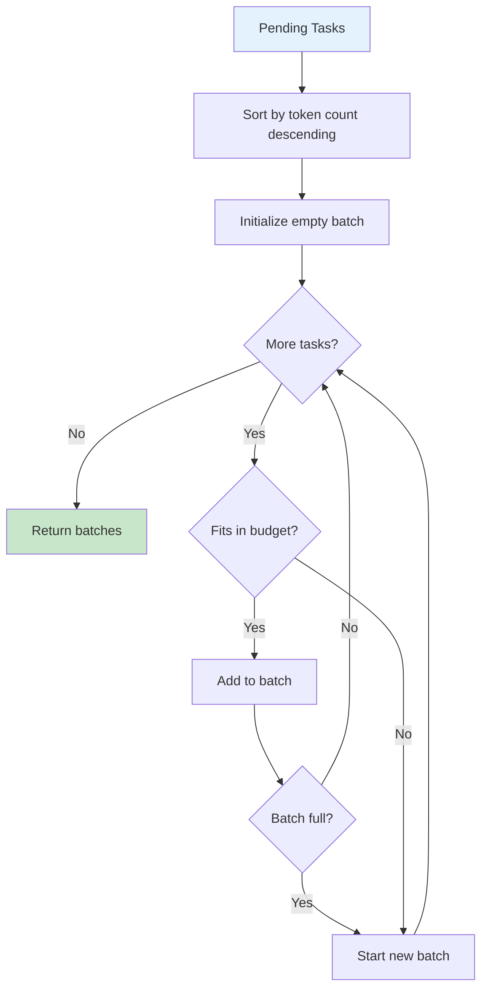
```mermaid
graph TD
    Start[Pending Tasks] --> Sort[Sort by token count descending]
    Sort --> Init[Initialize empty batch]
    Init --> Check{More tasks?}
    Check -->|No| Done[Return batches]
    Check -->|Yes| Fit{Fits in budget?}
    Fit -->|Yes| Add[Add to batch]
    Add --> Full{Batch full?}
    Full -->|Yes| New[Start new batch]
    Full -->|No| Check
    Fit -->|No| New
    New --> Check

    style Start fill:#e3f2fd
    style Done fill:#c8e6c9
```

#### 3. Argument Preparation

**Handles variable-length sequences**:

```python
async def prepare_args(self, batch_size: int):
    task_inputs = self._task_inputs

    tokens = []
    seq_lens = []
    page_ids = []
    start_positions = []

    for task_input in task_inputs:
        tokens.append(list(task_input.input_tokens))
        seq_lens.append(task_input.seq_len)          # Can differ!
        page_ids.append(list(task_input.page_ids))
        start_positions.append(task_input.start_position)  # Can differ!

    # Calculate max dimensions
    max_pages_needed = max(
        math.ceil(len(t) / self.block_seq_stride) for t in tokens
    )
    max_seq_len = max_pages_needed * self.block_seq_stride  # Page-aligned
    max_blocks = max(task.block_count for task in task_inputs)

    # Create padded buffers
    tokens_data = [pad_list(t, max_seq_len) for t in tokens]
    # ... create argument buffers
```

---

## Detailed Example Walkthrough

### Scenario Setup

```
Requests:
- R1: 250 tokens (prefill)
- R2: 300 tokens (prefill)

Configuration:
- block_seq_stride: 16 (tokens per page)
- ideal_chunk_size: 128 tokens (soft target for chunking)
- max_pages_per_batch: 16 (hardware/memory constraint)
- token_budget: 16 tokens/page × 16 pages = 256 tokens per batch

Note: No limit on number of requests per batch, only token budget matters
```

### Step 1: Chunking

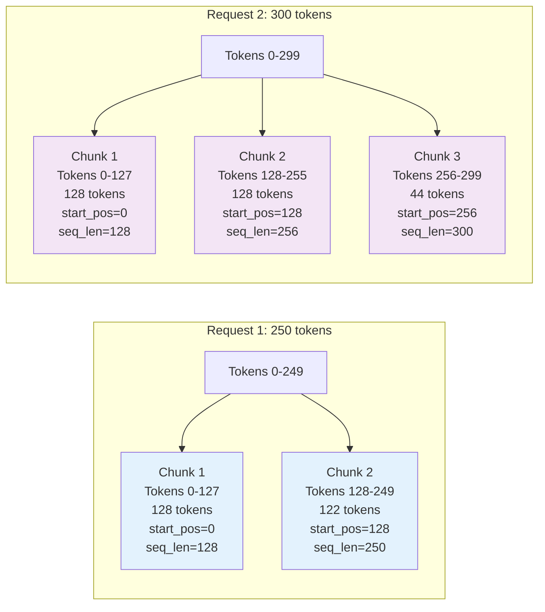
```mermaid
graph LR
    subgraph R1[Request 1: 250 tokens]
        R1Full[Tokens 0-249]
        R1Full --> R1C1[Chunk 1<br/>Tokens 0-127<br/>128 tokens<br/>start_pos=0<br/>seq_len=128]
        R1Full --> R1C2[Chunk 2<br/>Tokens 128-249<br/>122 tokens<br/>start_pos=128<br/>seq_len=250]
    end

    subgraph R2[Request 2: 300 tokens]
        R2Full[Tokens 0-299]
        R2Full --> R2C1[Chunk 1<br/>Tokens 0-127<br/>128 tokens<br/>start_pos=0<br/>seq_len=128]
        R2Full --> R2C2[Chunk 2<br/>Tokens 128-255<br/>128 tokens<br/>start_pos=128<br/>seq_len=256]
        R2Full --> R2C3[Chunk 3<br/>Tokens 256-299<br/>44 tokens<br/>start_pos=256<br/>seq_len=300]
    end

    style R1C1 fill:#e3f2fd
    style R1C2 fill:#e3f2fd
    style R2C1 fill:#f3e5f5
    style R2C2 fill:#f3e5f5
    style R2C3 fill:#f3e5f5
```

**Generated Tasks**:
```python
tasks = [
    # R1 chunks
    LlmTaskInput(rid="R1", input_tokens=(tok0..tok127),   seq_len=128, start_position=0,   page_ids=(0,1,2,3)),
    LlmTaskInput(rid="R1", input_tokens=(tok128..tok249), seq_len=122, start_position=128, page_ids=(0,1,2,3)),

    # R2 chunks
    LlmTaskInput(rid="R2", input_tokens=(tok0..tok127),   seq_len=128, start_position=0,   page_ids=(5,6,7,8,9)),
    LlmTaskInput(rid="R2", input_tokens=(tok128..tok255), seq_len=128, start_position=128, page_ids=(5,6,7,8,9)),
    LlmTaskInput(rid="R2", input_tokens=(tok256..tok299), seq_len=44,  start_position=256, page_ids=(5,6,7,8,9)),
]
```

### Step 2: Scheduler Batching

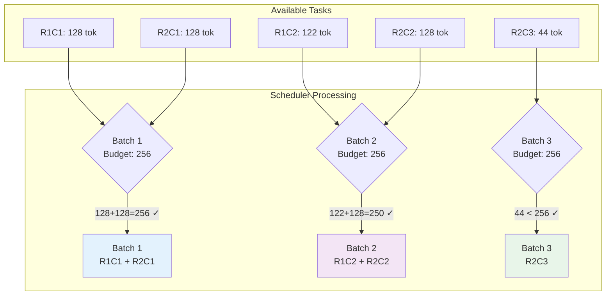
```mermaid
graph TD
    subgraph Available["Available Tasks"]
        T1[R1C1: 128 tok]
        T2[R1C2: 122 tok]
        T3[R2C1: 128 tok]
        T4[R2C2: 128 tok]
        T5[R2C3: 44 tok]
    end

    subgraph Processing["Scheduler Processing"]
        T1 --> B1Check{Batch 1<br/>Budget: 256}
        T3 --> B1Check
        B1Check -->|128+128=256 ✓| B1[Batch 1<br/>R1C1 + R2C1]

        T2 --> B2Check{Batch 2<br/>Budget: 256}
        T4 --> B2Check
        B2Check -->|122+128=250 ✓| B2[Batch 2<br/>R1C2 + R2C2]

        T5 --> B3Check{Batch 3<br/>Budget: 256}
        B3Check -->|44 < 256 ✓| B3[Batch 3<br/>R2C3]
    end

    style B1 fill:#e3f2fd
    style B2 fill:#f3e5f5
    style B3 fill:#e8f5e9
```

### Step 3: Invocation Details

#### Invocation 1: Batch [R1C1, R2C1]

**Input Arguments**:
```python
# Both chunks are 128 tokens
tokens = [
    [R1_tok0, R1_tok1, ..., R1_tok127, 0, 0, ..., 0],  # R1C1 padded to 128
    [R2_tok0, R2_tok1, ..., R2_tok127, 0, 0, ..., 0]   # R2C1 padded to 128
]  # Shape: [2, 128]

seq_lens = [128, 128]           # Both chunks are 128 tokens
start_positions = [0, 0]        # Both starting fresh
seq_block_ids = [
    [0, 1, 2, 3, 0, 0, 0, 0],   # R1 pages (padded)
    [5, 6, 7, 8, 9, 0, 0, 0]    # R2 pages (padded)
]  # Shape: [2, max_blocks]

cache_state = page_table  # Full page table tensor
```

**Model Processing**:
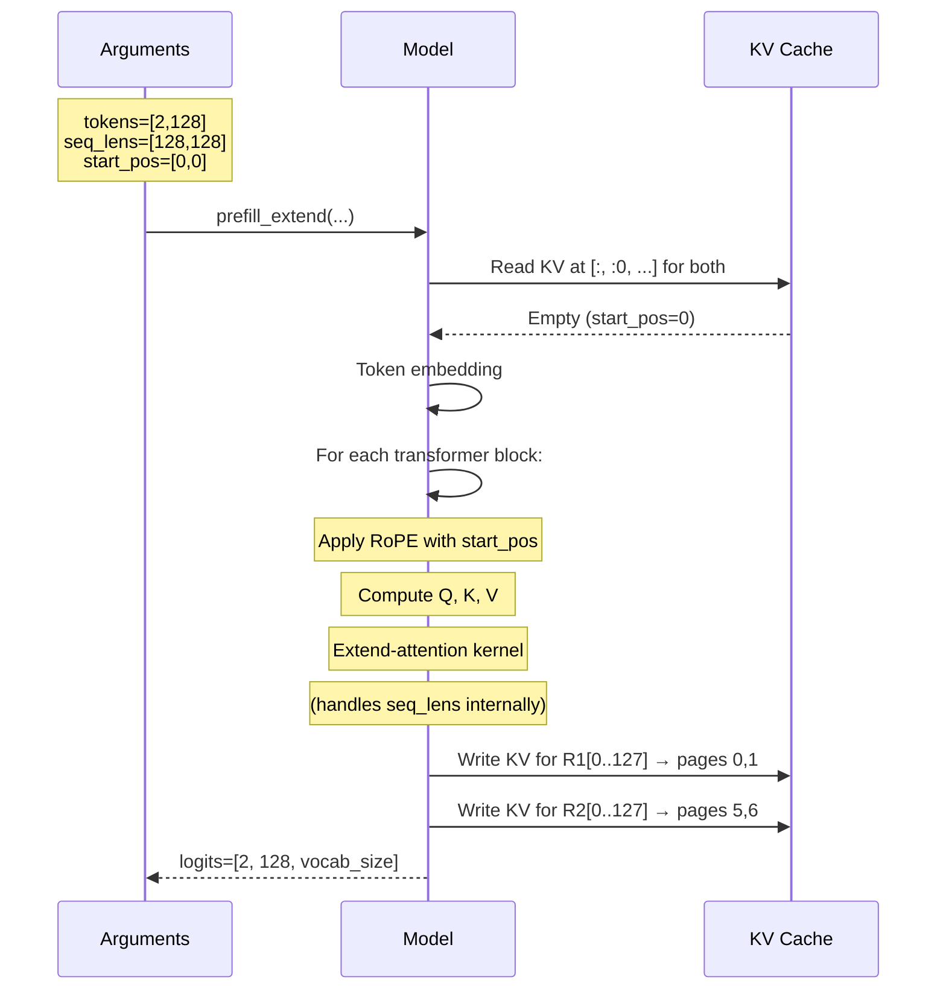
```mermaid
sequenceDiagram
    participant Args as Arguments
    participant Model as Model
    participant Cache as KV Cache

    Note over Args: tokens=[2,128]<br/>seq_lens=[128,128]<br/>start_pos=[0,0]

    Args->>Model: prefill_extend(...)

    Model->>Cache: Read KV at [:, :0, ...] for both
    Cache-->>Model: Empty (start_pos=0)

    Model->>Model: Token embedding
    Model->>Model: For each transformer block:
    Note over Model: Apply RoPE with start_pos
    Note over Model: Compute Q, K, V
    Note over Model: Extend-attention kernel
    Note over Model: (handles seq_lens internally)

    Model->>Cache: Write KV for R1[0..127] → pages 0,1
    Model->>Cache: Write KV for R2[0..127] → pages 5,6

    Model-->>Args: logits=[2, 128, vocab_size]
```

**Cache State After**:
```
Page 0: [R1 KV for tokens 0-15]
Page 1: [R1 KV for tokens 16-31]
Page 2: [R1 KV for tokens 32-47]
...
Page 5: [R2 KV for tokens 0-15]
Page 6: [R2 KV for tokens 16-31]
...
```

#### Invocation 2: Batch [R1C2, R2C2]

**Input Arguments**:
```python
# Different chunk sizes: 122 vs 128 tokens
tokens = [
    [R1_tok128, ..., R1_tok249, 0, ..., 0],  # R1C2: 122 tokens, padded to 128
    [R2_tok128, ..., R2_tok255, 0, ..., 0]   # R2C2: 128 tokens, padded to 128
]  # Shape: [2, 128]

seq_lens = [122, 128]           # DIFFERENT lengths! ✨
start_positions = [128, 128]    # Both continue from position 128
seq_block_ids = [
    [0, 1, 2, 3, 0, 0, 0, 0],   # R1 pages
    [5, 6, 7, 8, 9, 0, 0, 0]    # R2 pages
]  # Shape: [2, max_blocks]
```

**Model Processing**:
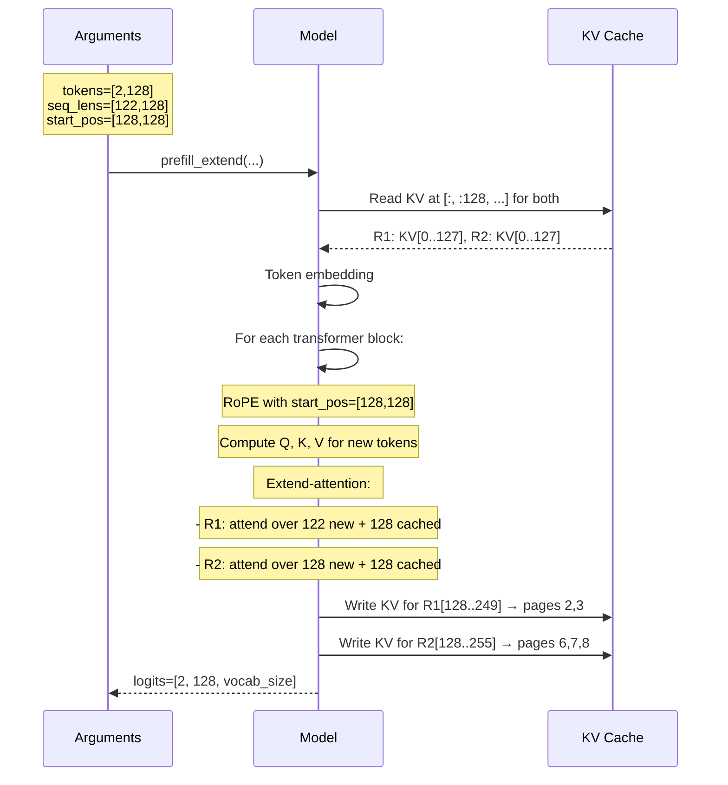
```mermaid
sequenceDiagram
    participant Args as Arguments
    participant Model as Model
    participant Cache as KV Cache

    Note over Args: tokens=[2,128]<br/>seq_lens=[122,128]<br/>start_pos=[128,128]

    Args->>Model: prefill_extend(...)

    Model->>Cache: Read KV at [:, :128, ...] for both
    Cache-->>Model: R1: KV[0..127], R2: KV[0..127]

    Model->>Model: Token embedding
    Model->>Model: For each transformer block:
    Note over Model: RoPE with start_pos=[128,128]
    Note over Model: Compute Q, K, V for new tokens
    Note over Model: Extend-attention:
    Note over Model: - R1: attend over 122 new + 128 cached
    Note over Model: - R2: attend over 128 new + 128 cached

    Model->>Cache: Write KV for R1[128..249] → pages 2,3
    Model->>Cache: Write KV for R2[128..255] → pages 6,7,8

    Model-->>Args: logits=[2, 128, vocab_size]
```

**Key Point**: The extend-attention kernel handles different `seq_lens` efficiently:
- R1 processes 122 tokens (ignores padding)
- R2 processes 128 tokens
- No wasted computation on R1's padding!

#### Invocation 3: Batch [R2C3]

**Input Arguments**:
```python
tokens = [
    [R2_tok256, ..., R2_tok299, 0, ..., 0]   # 44 tokens, padded to 48 or 64
]  # Shape: [1, 48] or [1, 64] (page-aligned)

seq_lens = [44]                 # Only 44 actual tokens
start_positions = [256]         # Continue from position 256
seq_block_ids = [
    [5, 6, 7, 8, 9, 0, 0, 0]    # R2 pages
]
```

**Model Processing**:
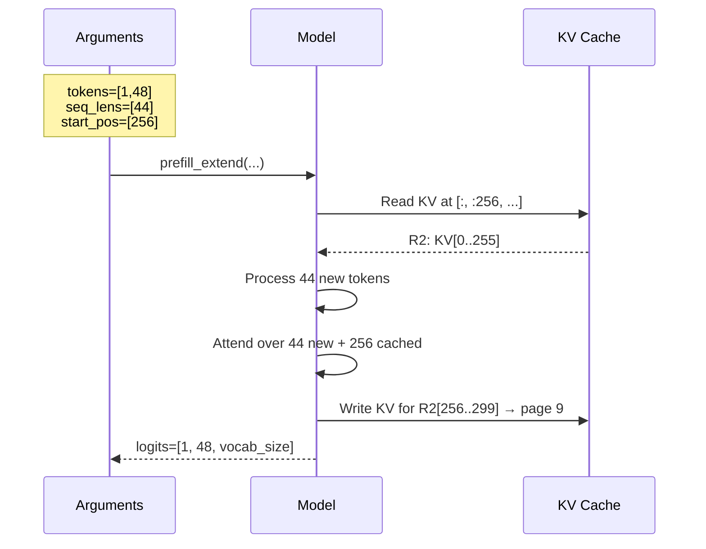
```mermaid
sequenceDiagram
    participant Args as Arguments
    participant Model as Model
    participant Cache as KV Cache

    Note over Args: tokens=[1,48]<br/>seq_lens=[44]<br/>start_pos=[256]

    Args->>Model: prefill_extend(...)

    Model->>Cache: Read KV at [:, :256, ...]
    Cache-->>Model: R2: KV[0..255]

    Model->>Model: Process 44 new tokens
    Model->>Model: Attend over 44 new + 256 cached

    Model->>Cache: Write KV for R2[256..299] → page 9

    Model-->>Args: logits=[1, 48, vocab_size]
```

### Step 4: Summary Timeline


```mermaid
gantt
    title Extend-Attention Processing Timeline
    dateFormat X
    axisFormat %s

    section Batch 1
    R1C1 (128 tok)  :b1r1, 0, 1
    R2C1 (128 tok)  :b1r2, 0, 1

    section Batch 2
    R1C2 (122 tok)  :b2r1, 1, 2
    R2C2 (128 tok)  :b2r2, 1, 2

    section Batch 3
    R2C3 (44 tok)   :b3r2, 2, 3
```

**Efficiency Metrics**:

| Batch | Requests | Total Tokens | Padding | Efficiency |
|-------|----------|--------------|---------|------------|
| 1 | R1C1, R2C1 | 256 | 0 | 100% |
| 2 | R1C2, R2C2 | 250 | 6 (R1 only) | 97.7% |
| 3 | R2C3 | 44 | 4 or 20 | 91.7% or 68.8% |

**Comparison with Chunked Prefill Mode**:

| Metric | Chunked Prefill | Extend-Attention |
|--------|----------------|------------------|
| Total Invocations | 5 | 3 |
| Largest Batch | 2 requests | 2 requests |
| Total Padding | Higher (fixed 128) | Lower (page-aligned) |
| Handles Variable Lengths | No | Yes ✓ |

---

## Implementation Checklist

### Required Changes

- [ ] **Chunking Logic** (`extend_attention.py`)
  - Add variable-size chunking based on ideal_chunk_size
  - Create multiple `LlmTaskInput` per request
  - Set correct `start_position` and `seq_len` for each chunk

- [ ] **Scheduler Enhancement** (`extend_attention.py`)
  - Already supports variable lengths ✓
  - May need tuning of token budget logic

- [ ] **Argument Preparation** (`extend_attention.py`)
  - Already handles variable lengths via `seq_lens` ✓
  - Verify page-aligned padding logic

- [ ] **Model Integration** (`llm.py`)
  - Ensure `prefill_extend` correctly uses `start_positions`
  - Verify per-request `seq_lens` handling

- [ ] **Kernel Support** (`wave_extend_attention`)
  - Verify variable-length handling in extend-attention kernel
  - Test with different `seq_lens` in same batch

### Testing Strategy

1. **Unit Tests**
   - Test chunking with various token counts (250, 300, 44)
   - Test scheduler batching logic
   - Test argument preparation with variable lengths

2. **Integration Tests**
   - Single request with chunking
   - Multiple requests with different chunk counts
   - Mixed chunk sizes in same batch

3. **Performance Tests**
   - Compare throughput vs default mode
   - Measure padding efficiency
   - GPU utilization metrics

---

## Glossary

| Term | Definition |
|------|------------|
| **Page** | Fixed-size block of KV cache memory (e.g., 16 tokens × cache dims) |
| **Page ID** | Index of a page in the page table |
| **Block Seq Stride** | Number of tokens per page (e.g., 16) |
| **Start Position** | Absolute position in sequence where chunk starts writing KV |
| **Seq Len** | Total sequence length processed so far (cumulative) |
| **Chunk** | Portion of a request's tokens processed in one invocation |
| **Task Input** | Metadata for a chunk to be processed |
| **Token Budget** | Maximum tokens that can fit in a batch (pages × stride) |
| **Extend-Attention** | Kernel that handles variable-length sequences via per-page history |

---

## References

- `shortfin/python/shortfin_apps/llm/components/batching/modes/extend_attention.py`
- `shortfin/python/shortfin_apps/llm/components/invocation.py`
- `sharktank/sharktank/layers/paged_attention.py`
- `sharktank/sharktank/kernels/wave/extend_attention.py`
- `sharktank/sharktank/models/llm/llm.py`
